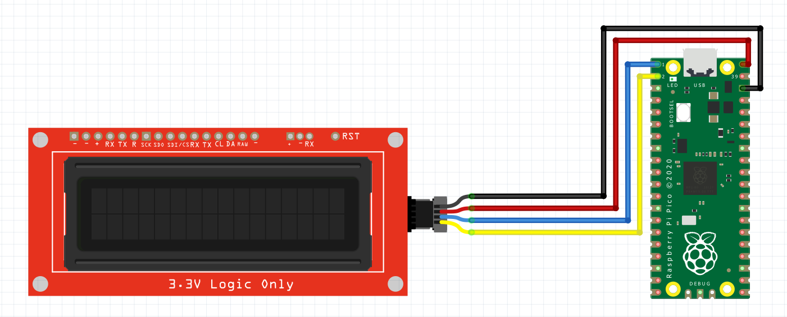

# RP2040 Temperature Display SerLCD i2c MicroPython

This repository contains the MicroPython code required to display the internal temperature reading from a RP2040 microcontroller found in the Raspberry Pi Pico to the SparkFun SerLCD via i2c.

# Getting Started

You can download the code and open it with Thonny and save it as main.py to your RP2040 device to make it run on boot.

# Wiring Diagram

# License

This project is licensed under the MIT License. This project contains code from the [Get Started with MicroPython on Raspberry Pi Pico](https://hackspace.raspberrypi.org/books/micropython-pico) guide and the [Qwiic_SerLCD_Py](https://github.com/sparkfun/Qwiic_SerLCD_Py) library from Sparkfun.
